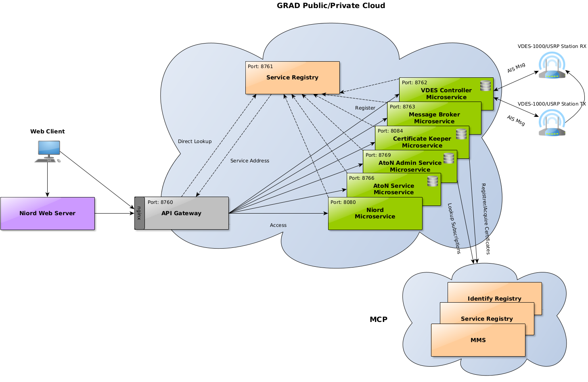

# eNav-Config

A repository that includes the configuration and Helm charts for deploying the
GLA e-Navigation Service Architecture

## What is e-Navigation

The maritime domain is facing a number for challenges, mainly due to the
increasing demand, that may increase the risk of an accident or loss of life.
These challenges require technological solutions and e-Navigation is one such
solution. The International Maritime Organization ([IMO](https://www.imo.org/))
adopted a ‘Strategy for the development and implementation of e‐Navigation’
(MSC85/26, Annexes 20 and 21), providing the following definition of
e‐Navigation:

E-Navigation, as defined by the IMO, is the harmonised collection, integration,
exchange, presentation and analysis of maritime information on-board and ashore
by electronic means to enhance berth-to-berth navigation and related services,
for safety and security at sea and protection of the marine environment.

In response, the International Association of Lighthouse Authorities
([IALA](https://www.iala-aism.org/)) published a number of guidelines such as
[G1113](https://www.iala-aism.org/product/g1113/) and
[G1114](https://www.iala-aism.org/product/g1114/), which establish the relevant
principles for the design and implementation of harmonised shore-based technical
system architectures and propose a set of best practices to be followed. In
these, the terms Common Shore‐Based System (CSS) and Common Shore‐based System
Architecture (CSSA) were introduced to describe the shore‐based technical system
of the IMO’s overarching architecture. In addition, in accordance with the IALA
Guideline G1114, the following services types are defined:

1. A **Data Collection and Data Transfer Service (DCT)** interfacing with the
shore-based AIS/VDES system to send the specified VAtoN information. 
2. A **Value Added Data Processing Service (VAD)**, that stores and distributes
the Virtual (but not excluding non-virtual ones) AtoN messages. An additional
service was also implemented to enable a geospatially-aware publish-subscribe
data exchange operation.
3. The **User Interaction Service (UIA)** specialised to provide the
Human‐Machine‐Interface (HMI) to the primary users of the CSSA.
4. The **Gateway Service (GWY)** to interface to external systems of third
parties.

To ensure the secure communication between ship and CSSA, the International
Electrotechnical Commission (IEC), in coordination with IALA, compiled a set of
system architecture and operational requirements for e-Navigation into a
standard better known as [SECOM](https://webstore.iec.ch/publication/64543).
This provides mechanisms for secure data exchange, as well as a TS interface
design that is in accordance with the service guidelines and templates defined
by IALA. Although SECOM is just a conceptual standard, the Maritime Connectivity
Platform ([MCP](https://maritimeconnectivity.net/)) provides an actual
implementation of a decentralised framework that supports SECOM.

## What is the GRAD e-Navigation Service Architecture

The GLA follow the developments on e-Navigation closely, contributing through
their role as an IALA member whenever possible. As part of their efforts, a
prototype GLA e-Navigation Service Architecture is being developed by the GLA
Research and Development Directorate (GRAD), to be used as the basis for the
provision of the future GLA e-Navigation services.

As a concept, the CSSA is based on the Service Oriented Architecture (SOA). A
pure-SOA approach however was found to be a bit cumbersome for the GLA
operations, as it usually requires the entire IT landscape being compatible,
resulting in high investment costs. In the context of e-Navigation, this could
become a serious problem, since different components of the system are designed
by independent teams/manufacturers. Instead, a more flexible microservice
architecture was opted for. This is based on a break-down of the larger
functional blocks into small independent services, each responsible for
performing its own orchestration, maintaining its own data and communicating
through lightweight mechanisms such as HTTP/HTTPS. It should be pointed out that
SOA and the microservice architecture are not necessarily that different.
Sometimes, microservices are even considered as an extension or a more
fine-grained version of SOA.

### The e-Navigation Service Architecture Overview

An overview of the e-Navigation Service Architecture is presented in the
following figure. As already mentioned this follows the IALA G1114 guideline.
The DCT ([VDES Controller](https://github.com/gla-rad/eNav-VDESController),
[Message Broker](https://github.com/gla-rad/eNav-MessageBroker)),
VAD ([AtoN Service](https://github.com/gla-rad/eNav-AtonService),
[AtoN Admin Service](https://github.com/gla-rad/eNav-AtonAdminService)) and UIA
([Niord](https://github.com/gla-rad/niord-uk))
services are all evident. In addition the
[API Gateway](https://github.com/gla-rad/eNav-APIGateway) component implements
the G1114 GWY service. The integration with the MCP is also demonstrated by the
link originating from the
[Certificate Keeper](https://github.com/gla-rad/eNav-CKeeper) microservice.
An additional component present in the figure that hasn’t been mentioned
previously is the internal [Eureka](https://github.com/gla-rad/eNav-Eureka)
service registry. This is another microservice component, only for internal use,
that allows the microservices present to be discovered and communicate with each
other without the need to establish static connections. In addition it allows
for a very flexible monitoring of the system and optionally a shared
configuration repository.

The figure also illustrates that the “API Gateway” becomes available to the
clients via a dedicated web server (nginx). This setup allows the architecture
to expose a different SSL certificate (not generated via the MCP) and also
permits higher flexibility where different e-Navigation systems could be served
in parallel.

Microservices are typically cloud-native, which means that they can easily be
deployed in a hosted cloud environment. This allows the architecture be scalable
in order to dynamically support a large number of requests. Scaling in this
context refers to the ability of the architecture to increase its capacity and
performance. In cloud environments, horizontal scaling in particular allows
applications to run in multiple independent instances, which are perceived by
the end-users as a single entity. Consequently, the microservices displayed in
the figure, are also included in a cloud environment, which can be public or
private, depending on the service provision requirements.

The current implementation is also enriched with additional functionality that
supports a
[Springboot Admin](http://docs.spring-boot-admin.com/current/index.html)
server for monitoring, as well as the incorporation of the 
[Spring Cloud Config](https://spring.io/projects/spring-cloud-config) server
with Eureka, os that it can support externalized configuration for the involved
microservices.

## Repository Structure

This repository brings together mupltiple aspects of the e-Navigation Service
Architecture configuration and deployement. Each is placed in a separate folder
in the top level directory structure:

* **charts**: Contains the definitions of Helm charts for deploying GLA the
e-Navigation Service Architecture into Kubernetes environments.
* **configuration**: This directory includes a set of application property files
(either as the ***.properties*** or ***.yaml***) that will will be distributes 
to the architecture services by the Eureka service.
* **images**: Contains a set of images used by the repository.

## Deployment Requirements

The current implementation is a quite complex system, and even with the
Kubernetes Helm charts being available, it require a set of preliminary work
to be deployed. You will first need:

* A functional kubernetes deployment with a
[Calico CNI](https://docs.tigera.io/calico/latest/getting-started/kubernetes/hardway/install-cni-plugin) 
and an
[Nginx Ingress](https://kubernetes.github.io/ingress-nginx/kubectl-plugin/)
plugin installed. 

* An operational PostgreSQL server with existing databases installed for the
following services. Note that since it's a bit complex to suppost persistence
is every Kubernetes environment (e.g. on bare-metal deployment) this method
was seen as preferable:

    * VDES-Controller
    * CKeeper
    * AtoN Service
    * AtoN Admin Service

* A separate [Keycloak](https://www.keycloak.org/) OIDC server. This
functionality can and probably will be included in the Helm charts in the
future. The database however, will need to be persisted elsewhere.

* A reachable Git repository to hold and distrubute the service configuration
from. This will be the configuration repository access by the Eureka service.
Examples of the configuration files required can be found under the 
***configuration*** top level directory. Notice that configuration secrets such
as usernames, passwords as so on, are all encoded and marked with the
***{cipher}*** prefix. **BE CAREFUL**: This repository much be carefully secured
as open access would ultimately leak all configuration secrets!

## Contributing
Pull requests are welcome. For major changes, please open an issue first to
discuss what you would like to change.

Please make sure to update tests as appropriate.

## License
Distributed under the Apache License. See [LICENSE](./LICENSE) for more
information.

## Contact
Nikolaos Vastardis - Nikolaos.Vastardis@gla-rad.org
